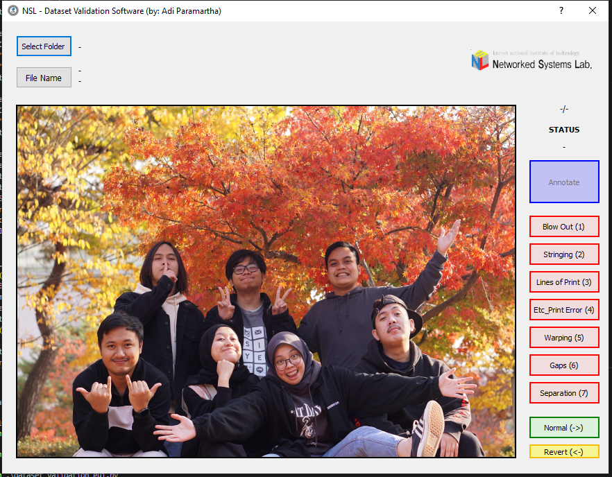
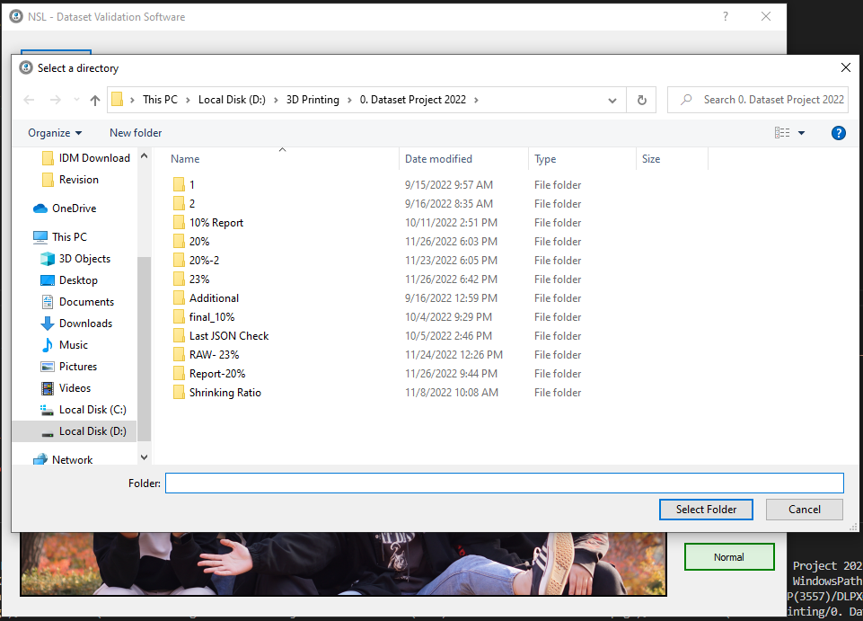
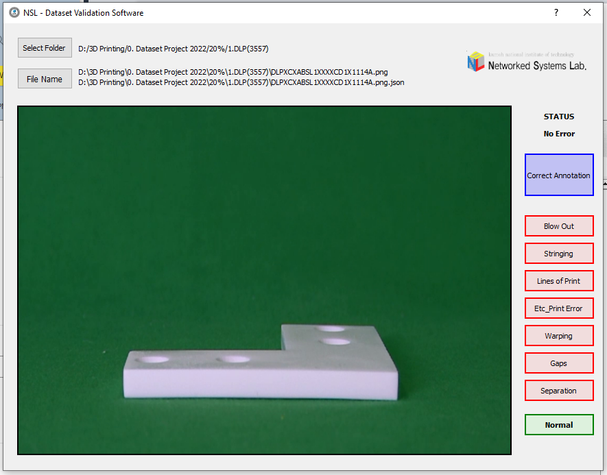
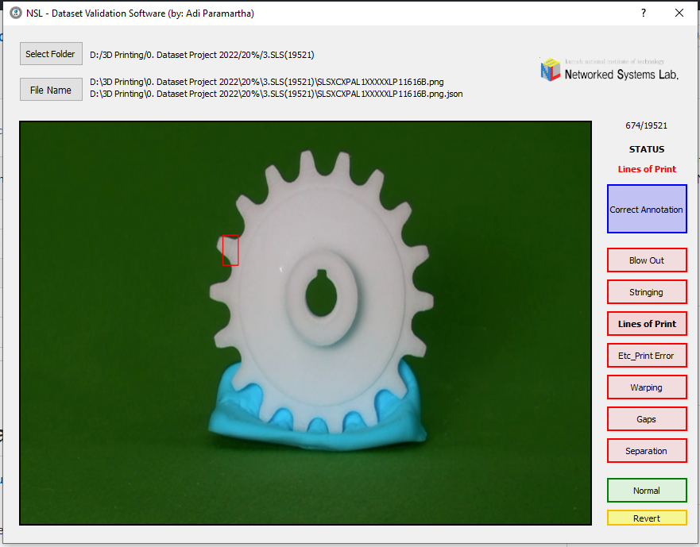
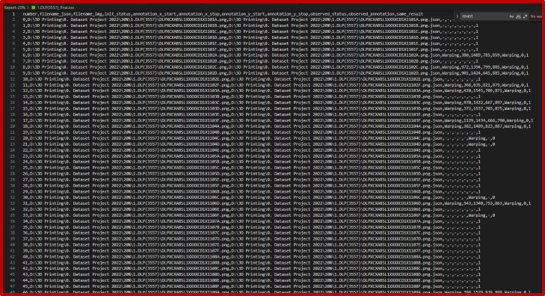

# MADE-iMageAnnotationDatasEtvalidation

This project allow you to validate JSON data with annotation that associcated with images file that located in the same folder.

Here are several screenshot of the program:
1. Home Screen\

2. Import Folder\

3. Start Validate\

4. Annotation Found\

5. Sample Output (CSV)\

For more info and suggestion:\
<mdparamartha95@kumoh.ac.kr> / <adi@primakara.ac.id> \

Networked System Laboratory\
[Website](http://nsl.kumoh.ac.kr/)
