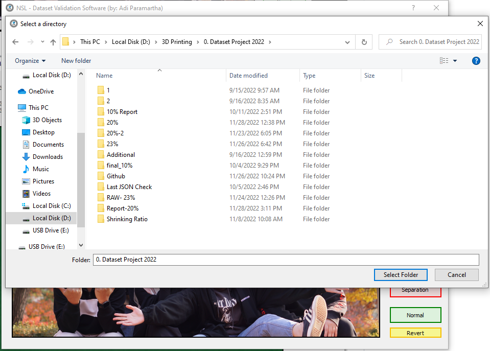
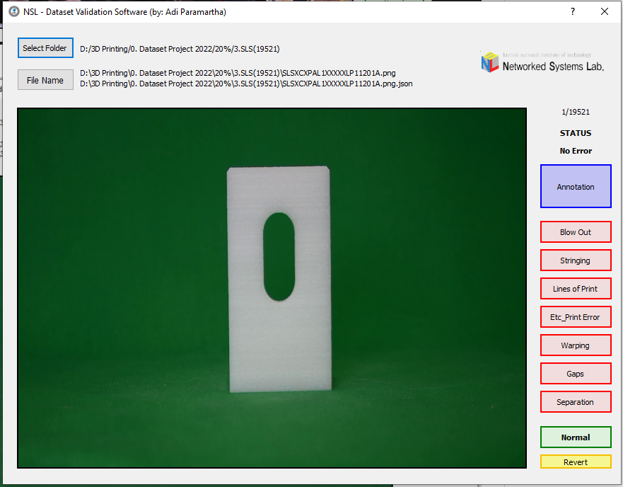

# MADE-iMageAnnotationDatasEtvalidation

This project allow you to validate JSON data with annotation that associcated with images file that located in the same folder.

Here are several screenshot of the program:
1. Home Screen

2. Import Folder

3. Start Validate

For more info and suggestion:
<mdparamartha95@kumoh.ac.kr> / <adi@primakara.ac.id>
